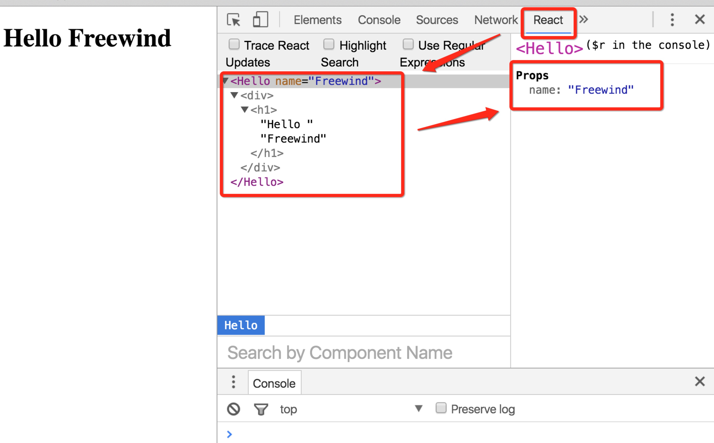

React Chrome Extension Demo
============================

Use React chrome extension to help development.

Install Dev Tool Extension
--------------------------

<https://chrome.google.com/webstore/detail/react-developer-tools/fmkadmapgofadopljbjfkapdkoienihi>

Note: you should config it by checking `Allow access to file URLs` if you want to open local html files (e.g. this example)

Setup
-----

```
npm install
webpack
```

Then open `index.html` in your browser.

Use
----



Note
-----

We can't use webpack-dev-server with this extension, since it doesn't support eract inside iframes. But with webpack-dev-server, our real react components are indeed inside an iframe.

